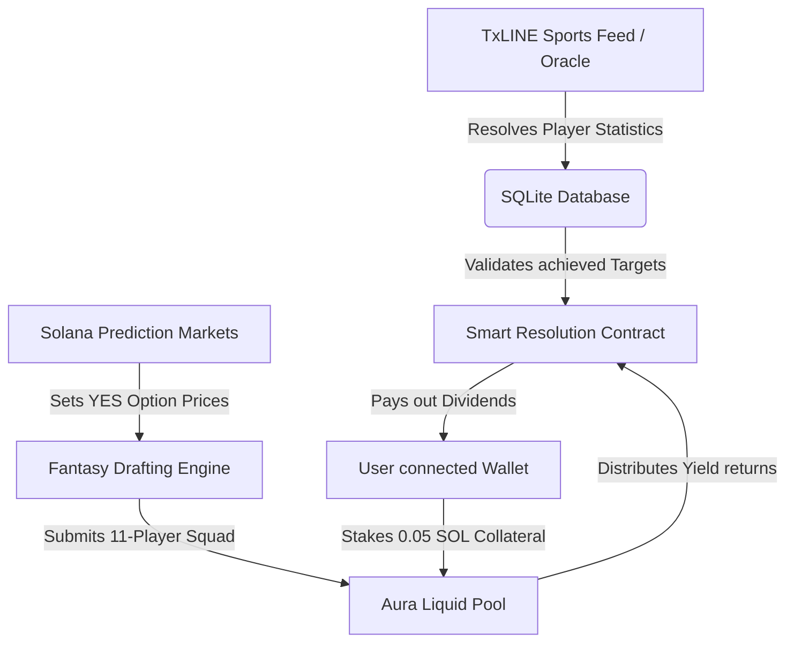

# Aura Liquid Fantasy (DeFi Sportstf) - Developer Documentation

Aura Liquid Fantasy binds the sports roster drafting engine with the Prediction Markets engine on Solana. Future developers should refer to this document to understand the pricing models, database keys, and yield mechanics.

---

## 1. System Architecture

The core of Aura Liquid Fantasy is the representation of drafted players as a **structured portfolio of binary options**. Instead of buying players using arbitrary static points, managers purchase **YES outcome contracts** on player performance.

---

## 2. Dynamic Player Option Pricing

Player draft prices scale dynamically between `$1.5M` and `$15.0M`, bound directly to the live trading price of their corresponding player outcome market (`yesPrice` between `15¢` and `99¢`):

$$\text{Roster Cost (Millions)} = \text{Option YES Price} \times 1.5$$

For example:
* **Lamine Yamal YES Option** trading at **65¢** maps to a draft cost of **$9.8M** (`65 * 1.5 = 97.5 decicredits`).
* **Underdog Value Option** trading at **20¢** maps to a draft cost of **$3.0M** (`20 * 1.5 = 30 decicredits`).

This dynamic pricing is seeded and calculated within `calculatePrices()` in [fantasy.ts](file:///Users/jakub/Projects/Prediction-hackathon/src/services/fantasy.ts#L523-L566).

---

## 3. Web3 Collateral Staking & Yield Payouts

Locking an 11-player squad requires a simulated deposit of **0.05 SOL** from the manager's connected wallet.

### Yield Calculation Formula
* **Collateral Pool Base**: `0.05 SOL`.
* Each player's YES Option contract represents `1/11th` of the squad portfolio.
* A fully resolved YES contract pays out **0.009 SOL**.
* The portfolio value scales dynamically as matches progress:

$$\text{Estimated Payout} = \sum_{p=1}^{11} \left(\frac{\text{Contract Value}_p}{100}\right) \times 0.009\text{ SOL}$$

$$\text{Portfolio ROI \%} = \left(\frac{\text{Estimated Payout} - 0.05\text{ SOL}}{0.05\text{ SOL}}\right) \times 100$$

Upon matchday finalization, players who score or assist resolve their YES Option contracts to **100¢**, and others to **0¢**, yielding the final payout dividends.

---

## 4. Database Schema Integration

* **Prediction Markets**: Player outcome contracts are stored as records in the `markets` table with `type = 'player_performance'` and `target_value` matching the player's name.
* **Squad Records**: Squad locks are registered in the `fantasy_squads` table with the layout formation and play day identifier.
* **Oracle Verification**: Match outcomes are synchronized using the **TxLINE Sports Oracle** via `syncPoints()` in [fantasy.ts](file:///Users/jakub/Projects/Prediction-hackathon/src/services/fantasy.ts#L536-L612).
