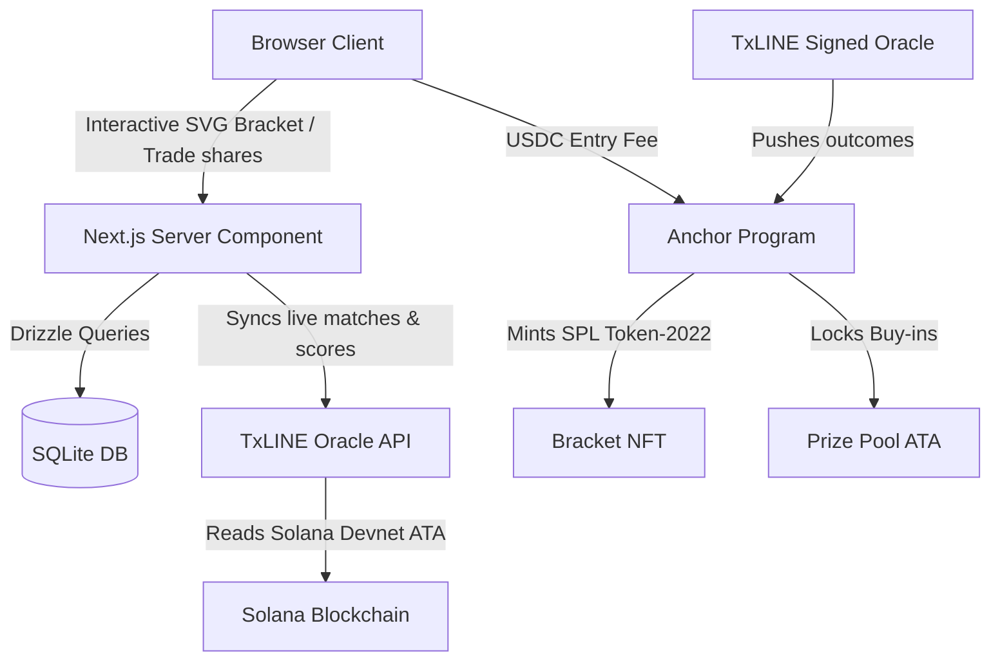

# AuraPredict | Decentralized World Cup Fan Platform

AuraPredict is an institutional-grade, decentralized fan engagement and prediction platform for the FIFA World Cup 2026. Built on a hybrid web3 architecture, it integrates a **Next.js App Router** frontend, a **local SQLite database** (managed via Drizzle ORM), an on-chain **Solana/Anchor tournament prize pool** with **Tradable Bracket NFTs**, and live sports feeds fetched from the **TxLINE sports oracle**.

---

## 1. System Architecture Overview



---

## 2. On-Chain Smart Contract Design: Tradable Bracket NFTs

AuraPredict introduces a novel web3 financial primitive: **Bracket Predictions as Tradable Assets (Bracket NFTs)**. Rather than locking predictions in a static off-chain database, players mint a dynamic, non-custodial SPL Token-2022 NFT containing their entire predicted bracket tree.

### A. The Core Innovation (Secondary Market Hedging)
1. **Minting:** A player locks their 31 predictions on-chain by paying a USDC or SOL entry fee to the Anchor program, which mints a `BracketNFT` containing their prediction vector in its metadata.
2. **Live Scoring:** As matches conclude, the TxLINE oracle signs and pushes results on-chain. Anyone can run a permissionless instruction `calculate_score` which checks the NFT's predictions against the oracle's results and writes the updated score directly into the NFT's metadata.
3. **Speculation & Hedging:** Because points are tracked on-chain directly inside the NFT, **players can buy, sell, or trade their active brackets mid-tournament on secondary marketplaces (like Tensor or Magic Eden)!**
   * *Example:* If a player has a perfect bracket heading into the Quarter-finals, their NFT is a front-runner for the prize pool. They can sell the NFT for a premium to secure a guaranteed profit. The buyer assumes the bracket's remaining upside and can claim the pool payout if it wins.

### B. Program Accounts Schema (Rust/Anchor)

#### `TournamentPool`
Manages the tournament state, entry fees, and prize disbursement.
```rust
#[account]
pub struct TournamentPool {
    pub admin: Pubkey,            // Admin authority
    pub oracle: Pubkey,           // TxLINE oracle public key authorized to write results
    pub entry_fee: u64,           // Buy-in fee in USDC (6 decimals) or SOL
    pub total_entrants: u32,      // Count of minted brackets
    pub prize_pool: u64,          // Total amount locked in the prize pool
    pub status: TournamentStatus, // NotStarted, Active, Finished
    pub final_winner_claimed: bool,
}
```

#### `OracleState`
Stores signed outcomes pushed by the TxLINE oracle.
```rust
#[account]
pub struct OracleState {
    // Stores the team ID (1-48) that actually won each of the 31 matches:
    // Index 0-15: R32 | Index 16-23: R16 | Index 24-27: QF | Index 28-29: SF | Index 30: Final
    pub results: [u8; 31], 
    pub last_updated: i64,
}
```

#### `BracketNFT`
Dynamic NFT state utilizing SPL Token-2022 Metadata extensions to store prediction states.
```rust
#[account]
pub struct BracketNFT {
    pub owner: Pubkey,            // Current owner of the bracket
    pub mint: Pubkey,             // NFT mint address
    pub predictions: [u8; 31],    // Array of 31 predicted team IDs (1-48)
    pub live_points: u32,         // Dynamic score calculated based on correctness
    pub last_scored_at: i64,
}
```

### C. Program Instructions (Anchor interface)

```rust
#[program]
pub mod aura_predict_bracket {
    use super::*;

    // 1. Initialize global tournament parameters and oracle verification keys
    pub fn initialize_tournament(ctx: Context<Initialize>, entry_fee: u64) -> Result<()> { ... }

    // 2. Deposit entry fee, mint SPL Token-2022 NFT, and embed predictions into metadata
    pub fn mint_bracket(ctx: Context<MintBracket>, predictions: [u8; 31]) -> Result<()> { ... }

    // 3. Oracle pushes match outcomes (verifying TxLINE cryptographic signature)
    pub fn record_match_result(ctx: Context<RecordResult>, node_idx: u8, winner_id: u8) -> Result<()> { ... }

    // 4. Permissionless recalculation of score; updates points in NFT metadata
    pub fn calculate_score(ctx: Context<CalculateScore>) -> Result<()> { ... }

    // 5. Transfer prize pool funds to the holder of the highest-scoring Bracket NFT
    pub fn claim_prize(ctx: Context<ClaimPrize>) -> Result<()> { ... }
}
```

---

## 3. Off-Chain Database Schema (Drizzle ORM)

The local SQLite database holds cached API state, user prediction markets orders, and portfolio shares. Managed via Drizzle ORM in [src/db/schema.ts](file:///Users/jakub/Projects/Prediction-hackathon/src/db/schema.ts):

* **`fixtures`**: Stores tournament match states synced from the TxLINE API:
  * `fixtureId` (Primary Key)
  * `participant1` / `participant2` (Team Names)
  * `score1` / `score2` (Goals scored, combining regular time + penalty shootouts)
  * `status` (`NotStarted`, `InPlay`, `Finished`)
  * `fixtureGroupId` (Groups matches by round: `10115677` for R32, `10115574` for R16)
* **`bracketPredictions`**: Stores local fallback copies of predictions matching user wallets:
  * `walletAddress`, `stage` (`R32`, `R16`, etc.), `matchKey` (e.g. `R32_1`), and `predictedWinner`.
* **`markets`**: Tracks YES/NO outcome contracts for live matches:
  * `fixtureId` (Foreign Key), `yesPrice` / `noPrice` (contract pricing between 1-99).
* **`shares`**: Tracks user holding balances for YES/NO outcome contracts.
* **`orders` / `trades`**: Limit order book matching logs.

---

## 4. TxLINE Sports Oracle Integration

AuraPredict connects dynamically to the TxLINE Sports Oracle API. The system handles on-chain credentials validation in [src/services/txline.ts](file:///Users/jakub/Projects/Prediction-hackathon/src/services/txline.ts):

1. **Guest Authentication:** Generates a JWT token by presenting a cryptographically signed challenge using the local Solana wallet keypair (from `~/.config/solana/id.json`).
2. **On-Chain Token Subscription:** AuraPredict checks the local wallet's SOL balance. It automatically registers a free service subscription on Solana Devnet, creates the Associated Token Account (ATA) for TxLINE tokens (TxL) when needed, and caches the long-lived API token in `txline_token_cache.json`.
3. **Live Syncing (`syncFixtures`):** Page fetches are kept completely fresh by calling the exported sync pipeline on every load. The sync routine:
   * Requests upcoming fixtures from the TxLINE API.
   * Resolves scores in parallel by querying `/api/scores/snapshot/{fixtureId}`.
   * Performs database `upsert` queries to preserve completed fixtures while maintaining fresh real-time scorelines and statuses.

---

## 5. Front-End: Radial SVG Bracket Predictor

The bracket predictor in [src/app/bracket/BracketPredictorClient.tsx](file:///Users/jakub/Projects/Prediction-hackathon/src/app/bracket/BracketPredictorClient.tsx) is rendered as an interactive, circular SVG diagram.

### A. Polar Coordinates Math
Nodes are mapped using polar-to-cartesian coordinate transformations around a central origin point $(x_c, y_c) = (500, 500)$:
$$x = 500 + R \cos(\theta)$$
$$y = 500 + R \sin(\theta)$$

* **Radii ($R$):**
  * `R32`: 430px | `R16`: 350px | `QF`: 270px | `SF`: 190px | `Final`: 110px | `Winner`: 0px.
* **Angles ($\theta$):**
  * Outer ring matches are distributed evenly. Parent nodes in the inner rings are placed at the exact mathematical midpoint angle of their two children:
    $$\theta_{\text{parent}} = \frac{\theta_{\text{child}_1} + \theta_{\text{child}_2}}{2}$$

### B. Correctness Visual Highlighting
Concentric connector paths are drawn dynamically using SVG arcs (`d="M x1 y1 A R R ..."`). Path strokes glow in different colors based on predictions:
* **Emerald Green (`#10B981`):** Correct prediction (user predicted winner, game finished and user was correct).
* **Crimson Red (`#EF4444`):** Incorrect prediction (user predicted team, game finished but team lost).
* **Glowing Blue (`#3B82F6`):** Active/Pending prediction (user predicted team, match is unplayed).
* **Faint Grey:** Empty/Unselected path.

### C. Live Result Propagation
* **Unplayed Matches:** If you select a team in the outer ring, that team's flag immediately advances to the next circle's slot, allowing you to preview your paths.
* **Finished Matches:** Once a match is marked as `Finished` in the database, the **actual winner** automatically propagates to the next round slot, locking the node to prevent posthumous cheating while preserving correctness highlights.

---

## 6. How to Run Locally

### Prerequisites
* **Node.js:** v18.0+
* **Local Solana Wallet:** Ensure you have a funded wallet keypair generated at `~/.config/solana/id.json`. Run `solana airdrop 2` on Solana Devnet to ensure you have sufficient SOL to cover Devnet transaction fees.

### Installation
1. Clone the repository and install dependencies:
   ```bash
   npm install
   ```
2. Run migrations to initialize the local SQLite database schema:
   ```bash
   npx drizzle-kit push
   ```
3. Start the Next.js development server:
   ```bash
   npm run dev
   ```
4. Access the platform at [http://localhost:4000/bracket](http://localhost:4000/bracket). The page will automatically query the TxLINE sports API and sync the latest results on load.
